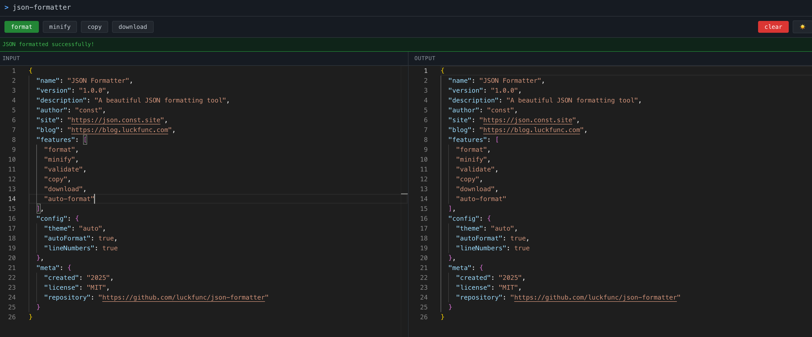

# JSON Formatter

A beautiful, fast, and reliable JSON formatter with syntax highlighting.

## Preview



## Features

- JSON formatting and validation
- JSON minification
- Copy to clipboard
- Download formatted JSON
- Dark/Light theme toggle
- Responsive design
- Syntax highlighting with Monaco Editor

## Development

This project uses pnpm as the package manager.

### Install dependencies
```bash
pnpm install
```

### Start development server
```bash
pnpm dev
```

### Build for production
```bash
pnpm build
```

### Preview production build
```bash
pnpm preview
```

### Linting
```bash
pnpm lint        # Check for issues
pnpm lint:fix    # Fix auto-fixable issues
```

## Tech Stack

- React 18
- TypeScript
- Vite
- Less
- Monaco Editor
- ESLint

## License

MIT